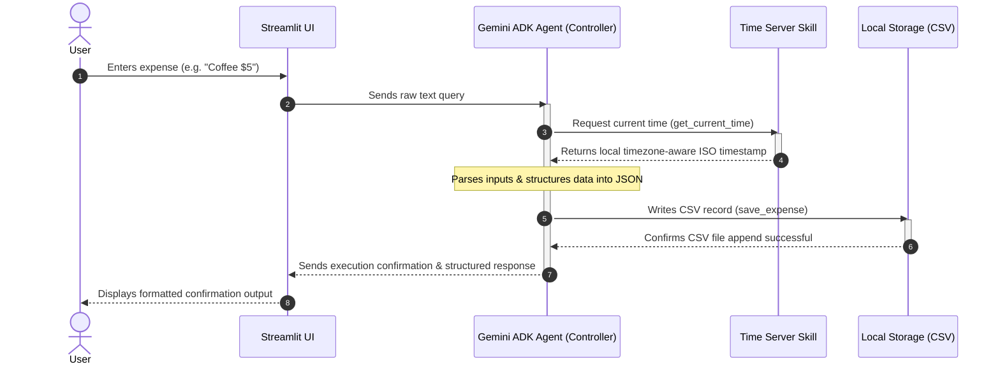

# VibeCash - Automated Expense Extraction Assistant

[](https://opensource.org/licenses/MIT)
[](#)
[](#)

VibeCash is a high-performance, AI-driven personal financial expense extraction assistant built for the Kaggle Capstone Project. Leveraging the **Google Agent Development Kit (ADK)** and the state-of-the-art **Gemini 3.5 Flash** model, VibeCash automatically parses unstructured natural language inputs, enriches them with timezone-aware host timestamps, and persists transactions directly to local structured storage.

---

## 1. Project Overview

Manual expense tracking is tedious and prone to friction. VibeCash solves this by allowing users to log transaction details in natural conversation format (e.g., *"Got coffee for 25000 VND"* or *"Paid $15 for dinner yesterday"*). The intelligent agent extracts:
* **Item / Category** (e.g., Coffee, Dinner)
* **Value / Amount** (e.g., 25000, 15)
* **Currency** (e.g., VND, USD)
* **Precise Local Timestamp** (e.g., `2026-07-05T13:50:09+07:00`)

By deploying modular agent skills, VibeCash accurately maps transactions, validates credential security, and stores them structured under an local CSV file.

---

## 2. Key Features

* **Natural Language Processing**: Contextual understanding of informal, multilingual financial descriptions powered by `gemini-3.5-flash`.
* **ADK Skill Execution**: Dynamically executes custom Python tools for fetching host timezone offsets and saving data safely.
* **Streamlit & CLI Front-Ends**: Interactive web dashboard utilizing a modern aesthetic, coupled with a robust command-line interface.
* **No Hardcoded Credentials**: Built-in security architecture that strictly loads credentials dynamically and manages active sessions.

---

## 3. System Architecture & Data Flow

VibeCash features a deterministic, state-driven workflow routing user queries directly to local CSV storage.

### Data Flow Diagram
```
[User Input] ──> [Streamlit UI] ──> [Gemini ADK Agent] ──> [Time Skill & CSV Storage] ──> [UI Confirmation]
```

### Execution Sequence
1. **User Input**: User enters raw text description of an expense into the front-end interface.
2. **Streamlit UI**: Formats and forwards the raw text payload to the Gemini ADK Agent.
3. **Gemini ADK Agent**: Acting as the central controller, the agent parses instructions, evaluates safety rules, and initiates tool calls.
4. **Time Skill & CSV Storage**:
   * The Agent calls the local **Time Server Skill** (`get_current_time`) to get a localized ISO 8601 timestamp.
   * The Agent aggregates the payload and triggers the **CSV Save Skill** (`save_expense`), writing details to `expenses.csv`.
5. **UI Output**: The Agent returns a structured transaction summary (Markdown Table/JSON) displayed to the user via the Streamlit interface.


*Note: For interactive rendering, you can inspect the Mermaid sequence schematic below:*



---

## 4. Tech Stack

| Component | Technology | Description |
| :--- | :--- | :--- |
| **Language** | Python 3.10+ | Core development language. |
| **Agent Framework** | Google ADK | Handles agent orchestration, execution, and state-sessions. |
| **Core Model** | Gemini 3.5 Flash | Large Language Model used for parsing and reasoning. |
| **Front-End** | Streamlit | Web client user interface. |
| **Timezone Skill** | `tzlocal` & `datetime` | Resolves timezone-aware local ISO time stamps on the host. |
| **Environment** | `python-dotenv` | Dynamic credential and API key injection. |

---

## 5. Setup Instructions

To run VibeCash locally, follow these configuration steps:

### Prerequisites
Make sure Python 3.10+ is installed on your local host machine.

### Step 1: Create a Virtual Environment
Isolate the python dependencies using `venv`:
```bash
# Create virtual environment
python -m venv venv

# Activate virtual environment
# On Linux/macOS:
source venv/bin/activate
# On Windows:
.\venv\Scripts\activate
```

### Step 2: Install Dependencies
Install all required modules pinned in [requirements.txt](requirements.txt):
```bash
pip install -r requirements.txt
```

### Step 3: Configure Environment variables
Create a `.env` file in the root project directory:
```bash
touch .env
```
Populate it with your Gemini API credentials. The application dynamically handles key mapping:
```env
GEMINI_API_KEY=your_actual_gemini_api_key_here
```
*(Note: Do not commit the `.env` file to your source repository.)*

### Step 4: Run the Application
You can interact with VibeCash via two interface options:

#### Run Streamlit Web UI
```bash
streamlit run app.py
```

#### Run CLI Terminal UI
```bash
python main.py
```

---

## 6. Future Scope

* **Multimodal Extraction**: Support scanning and OCR receipt upload formats directly through Streamlit.
* **Advanced Analytics Dashboard**: Display category-based monthly spending distributions using Streamlit charts.
* **Database Integration**: Migrate local CSV storage to Postgres or SQLite database backend for concurrent access.
* **Budget Alerts**: Enable proactive alerting when categories exceed custom budgets.
